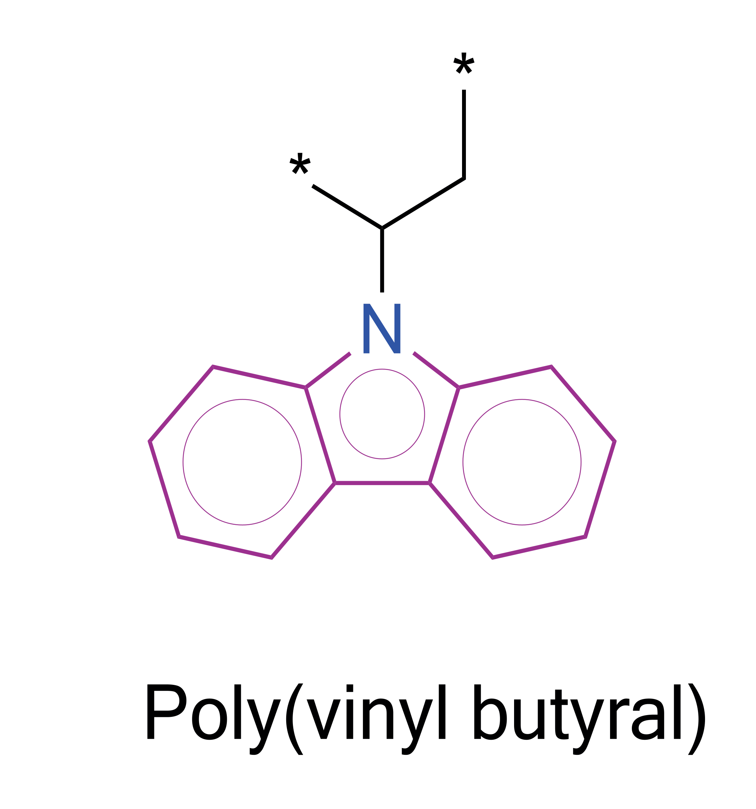

# How To Guides

## Featurization 

### Applying a single featurizer to a polymer

``` python
from polymetrix.featurizers.polymer import Polymer
from polymetrix.featurizers.chemical_featurizer import MolecularWeight
from polymetrix.featurizers.sidechain_backbone_featurizer import FullPolymerFeaturizer

# initialize the FullPolymerFeaturizer class with required featurizers
featurizer = FullPolymerFeaturizer(MolecularWeight()) # (1)

polymer = Polymer.from_psmiles('*CCCCCCNC(=O)c1ccc(C(=O)N*)c(Sc2ccccc2)c1') # (2)
result = featurizer.featurize(polymer)
```

1. `polymetrix` uses `Featurizer` objects similar to `matminer` or `mofdscribe`, which follows the `sklearn` API. The `FullPolymerFeaturizer` class is used to apply a featurizer to the entire polymer repeating unit. 
2. `polymetrix` is built around the `Polymer` class, which is used to represent a polymer molecule. The `from_psmiles` method is used to create a polymer molecule from a polymer SMILES string.

The result will be a NumPy array of MolecularWeight value for the given polymer.


### Combining multiple featurizers for a polymer

``` python
from polymetrix.featurizers.polymer import Polymer
from polymetrix.featurizers.chemical_featurizer import MolecularWeight, NumHBondDonors, NumHBondAcceptors, NumRotatableBonds
from polymetrix.featurizers.sidechain_backbone_featurizer import FullPolymerFeaturizer
from polymetrix.featurizers.multiple_featurizer import MultipleFeaturizer

# initialize the FullPolymerFeaturizer class with required featurizers
mol_weight_featurizer = FullPolymerFeaturizer(MolecularWeight())
hbond_donors = FullPolymerFeaturizer(NumHBondDonors())
hbond_acceptors = FullPolymerFeaturizer(NumHBondAcceptors())
rotatable_bonds = FullPolymerFeaturizer(NumRotatableBonds())

featurizer = MultipleFeaturizer([mol_weight_featurizer, hbond_donors, hbond_acceptors, rotatable_bonds]) # (1)
polymer = Polymer.from_psmiles('*CCCCCCNC(=O)c1ccc(C(=O)N*)c(Sc2ccccc2)c1')
result = featurizer.featurize(polymer)
```

1. The advantage of using `MultipleFeaturizer` is that it allows you to combine multiple featurizers into a single featurizer object. This way, you can apply multiple featurizers to the polymer in a single step. The `MultipleFeaturizer` behaves like a "regular" featurizer, so you can use it in the same way as a single featurizer.


The result will be a NumPy array of `mol_weight_featurizer, hbond_donors, hbond_acceptors, rotatable_bonds` values for the given polymer.


### Featurizers for the sidechain level of the polymer
The below image shows the difference between side chain and backbone of a polymer, Where the side chain is the part of the polymer that is not part of the main chain (highlighted in purple) and the backbone is the main chain of the polymer (highlighted in black).
{width="50%" height="50%"}

``` python
from polymetrix.featurizers.polymer import Polymer
from polymetrix.featurizers.multiple_featurizer import MultipleFeaturizer
from polymetrix.featurizers.chemical_featurizer import NumAtoms
from polymetrix.featurizers.sidechain_backbone_featurizer import SideChainFeaturizer, NumSideChainFeaturizer

# initialize the SideChainFeaturizer class with required featurizers
num_sidechains = NumSideChainFeaturizer()
sidechain_length = SideChainFeaturizer(NumAtoms(agg=["sum", "mean", "max", "min"]))

featurizer = MultipleFeaturizer([num_sidechains, sidechain_length])
polymer = Polymer.from_psmiles('*CCCCCCCCOc1ccc(C(c2ccc(O*)cc2)(C(F)(F)F)C(F)(F)F)cc1')
result = featurizer.featurize(polymer)
```
The result will be a NumPy array of `num_sidechains` and `sidechain_length` values for the given polymer.


### Featurizers for the backbone level of the polymer

``` python
from polymetrix.featurizers.polymer import Polymer
from polymetrix.featurizers.multiple_featurizer import MultipleFeaturizer
from polymetrix.featurizers.chemical_featurizer import NumAtoms
from polymetrix.featurizers.sidechain_backbone_featurizer import SideChainFeaturizer, NumSideChainFeaturizer, BackBoneFeaturizer, NumBackBoneFeaturizer

# initialize the BackBoneFeaturizer class with required featurizers
num_backbones = NumBackBoneFeaturizer()
backbone_length = BackBoneFeaturizer(NumAtoms(agg=["sum"])) # Polymer cannot have more than one backbone

featurizer = MultipleFeaturizer([num_backbones, backbone_length])
polymer = Polymer.from_psmiles('*CCCCCCCCOc1ccc(C(c2ccc(O*)cc2)(C(F)(F)F)C(F)(F)F)cc1')
result = featurizer.featurize(polymer)
```
The result will be a NumPy array of `num_backbones` and `backbone_length` values for the given polymer.


## Datasets 

### Loading datasets 

Additionally, you can load the curated dataset for glass transition temperature (Tg) data for the polymers using this package.

``` python
# Import necessary modules
from polymetrix.datasets import CuratedGlassTempDataset

# Load the dataset
dataset = CuratedGlassTempDataset()
```

The dataset will be a class object that contains the data for the curated dataset for glass transition temperature (Tg) data for the polymers along with chemical and topological featurizers for the polymers.


### Obtaining features and labels from the dataset

``` python
from polymetrix.datasets import CuratedGlassTempDataset

dataset = CuratedGlassTempDataset()
features = dataset.get_features(idx=range(len(dataset))
target = dataset.get_labels(idx=range(len(dataset)))
```

This will output the array of features and labels for the dataset, Which can be used for training/testing the model.


### Obtaining a subset of the dataset

```python
from polymetrix.datasets import CuratedGlassTempDataset

dataset = CuratedGlassTempDataset()
features = dataset.get_features(idx=[0, 1, 2, 3, 4, 5, 6, 7, 8, 9])
target = dataset.get_labels(idx=[0, 1, 2, 3, 4, 5, 6, 7, 8, 9])
```

This will output the array of features and labels for the first 10 data points in the dataset, Which can be used for training/testing the model.
